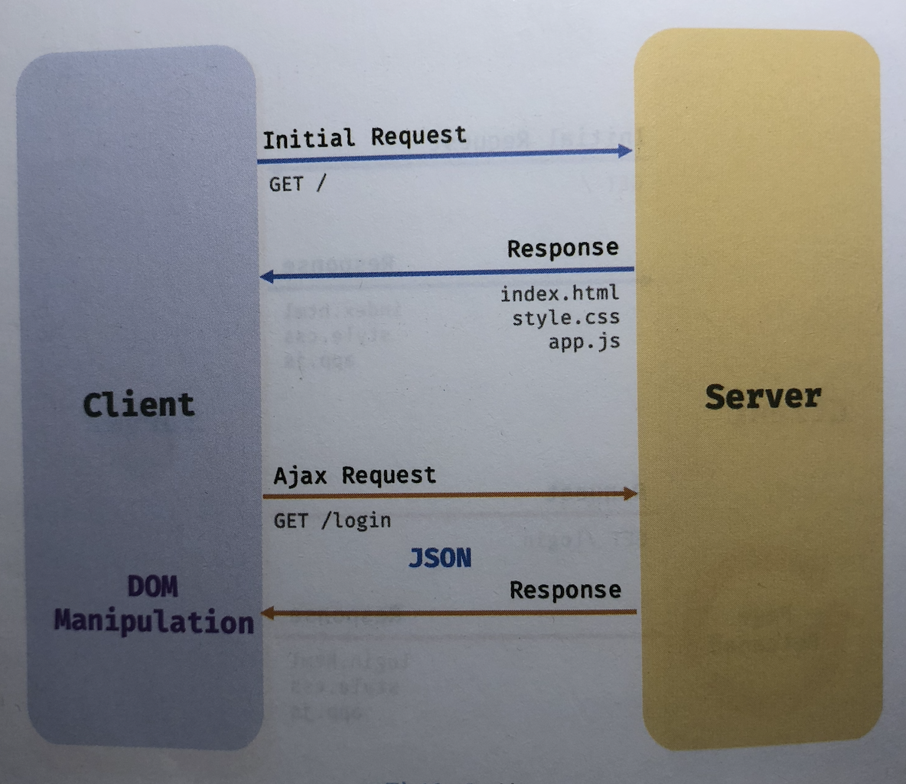

### 이벤트 루프와 태스크 큐  
*  자바스크립트 = 싱글스레드 = 한 번에 하나의 task 처리만 가능
*  하지만, 1개 이상의 데이터 처리를 하는 것은 ***이벤트 루프*** 때문이다.
*  이벤트 루프 = 브라우저 내장 기능

    
> 이벤트 루프와 브라우저 환경

 * task queue : setTImeout, setInterval 과 같이 비동기 함수의 콜백 함수 또는 Event handler 가 일시적으로 보관되는 영역


💡 JS는 싱글 스레드 방식으로 동작, 이때 싱글 스레드 방식으로 동작하는 것은 브라우저가 아니라 브라우저에 내장된 JS 엔진이라는 거!
💡 JS 엔진은 싱글 스레드로 동작하지만 브라우저는 멀티 스레드로 동작한다.


### AJAX
 * 브라우저가 서버에게 비동기 방식으로 데이터를 요청하고, 서버가 응답한 데이터를 수신하여 웹페이지를 동적으로 갱신하는 프로그램 방식          
  ****

> 전통적인 웹 페이지의 생명 주기

   * 단 점
     1. 이전 페이지와 일부 변경되어도 전 부분을 서버로부터 다시 전송받기 때문에 불필요한 데이터 통신 발생
     2. 처음부터 다시 rendering. 순간 깜빡이는 현상 발생
     3. client와 server가 동기식 방식으로 서버로부터 응답이 있을 때까지 다음 처리는 blocking.

   
        
         > Ajax
    * 전통적인 방식과 비교했을 때 장 점    
        1. 필요한 부분만 서버로부터 전송받는다.
        2. 변경할 필요가 없는 부분은 렌더링 하지 않는다.
        3. 비동기방식으로 작동하기 때문에 블로킹 발생이 없음

### JSON
* 클라이언트와 서버 간의 HTTP 통신을 위한 텍스트 데이터 포맷
* 반드시 큰 따움표( 작은 따음표 사용 불가)로 묶어야 한다.

    #### JSON.stringify
     + 위 메서드는 객체를 JSON 포맷의 문자열로 변환시켜준다.
        
        ```javascript
            const obj = { name: 'Lee', age: 20, alive: true, hobby: ['traveling','tennis']}

            const json = JSON.stringify(obj)
            // { "name": "Lee", "age": 20, "alive": true, "hobby": ["traveling","tennis"]}
        ```

    #### JSON.parse
     + 위 메서드는 JSON 포맷의 문자열을 객체로 변환한다.
        
        