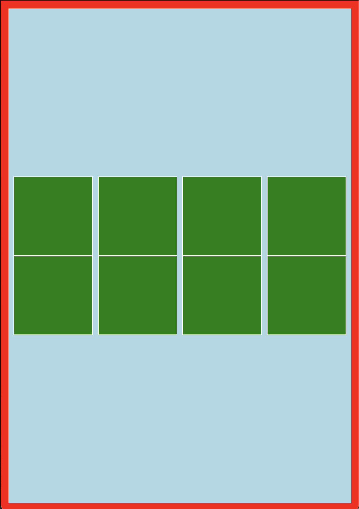

💡✔️❌❓❔👀➕➖⚠️📝🐧👍👎


## CSS METHODOLOGY
 * DRY, 반복을 줄이는게 software의 개발원칙
 * 읽기 쉽고, 유지가능하고 조직적인 코드를 작성하는게 중요하다
 * 재사용화, 간결화, 확장성, 예측성

 ### BEM METHODOLOGY ( Block Element Modifier)
  * 객관적인 규칙을 통해 쉬운 의미 예측을 가낭하게 하는 기법
  * 블록, 요소, 상태 구분하여 클래스를 작성하고, 강한 네이밍룰을 따른다.
      * Block: 재사용이 가능하고 기능적으로 독립된 COMPONENT, 위치에 대한 값을 가지지 않는다.
      * Element: 블록 내부 구성을 표현, 2개의 Under-bar 표현
      * Modifier: 요소의 상태를 표현 2개의 '--` 사용

   
   * 코드 직관적으로 이해가능하며, css의 구조적으로 파악이 가능. 단 code 네이밍이 길어진다는 단점이 있다.
   * SASS, SCSS와 사용하기 편하며, 대규모 CSS를 효율적으로 관리 가능


## 3. HTML - 선택자
  
  ### 자손 선택자

  ```html
    <ul>
      <li>
        자식 요소
        <ol>
          <li>자손 요소</li>
        </ol>
      </li> 
    </ul>
  ```
  

------
### 자식 선택자
----


----

### 다양한 요소 선택하기
  * ul li:nth-of-type(1) { border: 1px solid blue} 
    * ul li 의 첫번째만 선택하기
  * ul li:nth-of-type(2n) { border: 1px solid blue} 
    * ul li 의 짝수 요소 선택하기 ( 3n, 4n 가능 )
    * ul li:nth-of-type(2n-1) 하면 홀수 요소만 선택  
     
  * ul li:last-child { border: 1px solid blue}
    * 마지막 요소만 선택 
    
  * ul li:nth-of-type(even) { border: 1px solid blue} 
  * ul li:nth-of-type(odd) { border: 1px solid blue} 
    * 홀수, 짝수 요소 선택 가능


## 3-3 폰트 스타일링

  ### 폰트 굵기 바꾸기
  ```html
      font-weight: normal; or bold
  ```
----
  ### 폰트 크기 바꾸기
  ```html
      font-size: px, rem, em
  ```
  * px : 픽셀 단위로 크기 설정
  * rem : 최상위 부모인 <html> 태그 기준으로 폰트 크기 설정
  * em : 부모 요소를 기준으로 폰트 크기 설정  ~~잘 사용하지 않음~~ ❌

---
### 텍스트 줄 간격 바꾸기
 #### line-height
        * 실수값 : 줄 간격을 폰트 크기에 맞추어 실수 배율로 지정
        * 픽셀값 : 줄 간격을 고정된 px 단위로 지정, 즉 font-size 기준으로 설정된다.
---
### 텍스트 정렬 방향 지정하기
 #### text-align : left, center, right, jusitfy(양쪽정렬)

---
## 3-4 웹 페이지에서 영역별 크기 정하기

 ### 너비와 높이 지정하기
  #### width, height
  * px : 너비 값, 높이 값을 px 단위로 지정
  * % : 부모 태그 기준으로 % 단위로 지정
  * vw : 웹 브라우저 너비 기준으로 백분율로 지정한
  * **`vh` : 웹 브라우저 높이를 기준으로 너빗 값과 높잇 값을 지정**

---

### 바깥쪽 여백 지정하기
 #### margin
  * px : 태그의 바깥쪽 여백은 px 단위로 지정
  * % : 부모 태그 기준으로 % 단위로 지정
  * vw : 웹 브라우저 너비 기준으로 백분율로 지정한
  * **`vh` : 웹 브라우저 높이를 기준으로 바깥쪽 여백을 백분율로 지정**
 ```js
.one { margin: 20px; }  // 상하좌우 20px만큼 지정
.zwei { margin: 20px 50px;} // 상하는 20px, 좌우 50px 지정
👍👍.drei { margin: 20px auto; } // 상하 20px 좌우는 무조건 중앙(auto) 지정 👍👍
👍👍.vier { margin: 20px auto 40px; } // 위쪽은 20px, 좌우는 중앙, 아래쪽은 40px 👍👍
.funf { margin: 0px 10px 20px 30px; } // 시계방향으로 위, 오, 아, 왼 각각 지정
```
---

### 안쪽 여백 지정하기
 #### padding
  * px : 태그의 안쪽 여백은 px 단위로 지정
  * % : 부모 태그 기준으로 % 단위로 지정
  * vw : 웹 브라우저 너비 기준으로 백분율로 지정한
  * **`vh` : 웹 브라우저 높이를 기준으로 안쪽 여백을 백분율로 지정**

---

### 블록 요소와 인라인 요소 태그
 #### 블록요소 
    <h1> ~ <h6>, <p>, <ol>, <ul>, <div>, <header>, <footer>, <section>, <airticle>, <aisde>, <nav>
 1. 줄을 자동으로 바꾼다.
 2. 너비와 높이를 지정 가능
 3. 너비를 지정하지 않으면 부모요소 너비값의 100%를 상속받는다.
 4. 블록 요소와 인라인 요소 모두 묶을 수 있다. 

 #### 인라인 요소
    <strong>, <em>, <a>, <span>
 1. 자동 줄 바꿈이 되지 않고 옆으로 나열된다.
 2. 너비와 높이를 지정 불가능
    + `display: inline-block` 설정하면 너비와 높이 설정 가능
 3. 인라인 태그를 사용한 크기가 해당 요소의 크기가 된다.
 4. 인라인 요소만 묶을 수 있다.

**블록요소는 웹 페이지의 영역을 구분하는 레이아웃과 관련, 인라인 요소는 글의 서식과 관련된다는 특징**

## 3-6 웹 페이지 레이아웃 구성하기

 #### position - 요소 자유롭게 배치하기
  * relative : 적용된 요소의 현재 위치값을 기준으로 `상대위치`
  * absolute : 부모 요소의 특정 구간을 기준으로 `절대위치`
  * fixed : 웹 브라우저를 기준으로 `절대위치`

---

## 5-1 FLEX
 * display
   * flex: 자신은 블록 속성을 유지하면서 자식 요소에 flex 환경설정
   * inline-flex: 자신을 인라인 속성으로 변경하면서 자식 요소에 flex 환경 설정
 * flex-direction
   * row: flex의 기본축을 가로로 지정
   * column: flex의 기본축을 세로로 지정
   * row-reverse: 자식 요소 콘텐츠를 가로 역순으로 정렬
   * column-reverse: 자식 요소 콘텐츠를 세로 역순으로 정렬
 * flex-wrap
   * nowrap: 자식 요소의 줄 바꿈을 하지 않는다.
   * wrap: 자식 요소의 줄 바꿈 한다.(브라우저를 줄이면 자동으로 줄 바꿈이 된다.)

### align-content, align-items
 * **`justify-content` 속성이 기본 축의 정렬방식이라면, `align` 은 반대 축의 정렬방식이다.**
 * 자식 요소가 여러 개라서 줄 바꿈이 필요할 때 : `align-content`
 * 자식요소가 1개이거나 줄 바꿈이 필요없다면: `align-items`
 ```javascript
    * flex-start: 자식 요소를 시작방향으로 정렬
    * flex-end: 자식 요소를 종료 방향으로 정렬
    * center: 자식 요소를 가운데로 정렬
    * space-between: 균등정렬(처음과 끝부분 여백없이)
    * space-around: 균등정렬(처음과 끝부분이 여백이 동일하게, 블럭사이 공간보다 작음)
    * space-evenly: 균등정렬(처음과 끝부분이 다른공간과 동일한 간격)
```

 ✔️ display: flex
 ✔️ flex-flow: row wrap;
 ✔️ justify-content: space-evenly
 ✔️ ***align-items: center*** 
 [적용결과]
  
  > 자식요소가 한 줄이라 `align-center` 가 제대로 적용되었다. 하지만 `웹 브라우저의 너비`를 줄이게 될 경우 `가운데 정렬`이 되지 않는다. 이럴경우 `align-items` 대신에 `align-content` 속성 적용
  `align-content` 속성을 사용할 경우 `flex-flow: wrap`을 반드시 입력

  

  > 요소가 줄 바꿈하더라도 간격이 벌어지지 않고 세로로 가운데 배치된다. 이처럼 줄바꿈을 해야 하는 자식요소가 여러 개 있다면 `align-content`, 그렇지 않으면 `align-items`
  ----

  