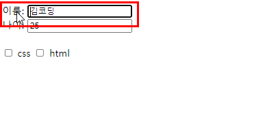
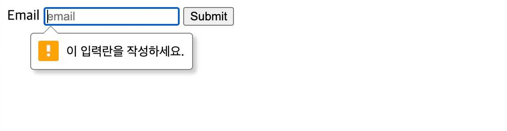

💡✔️❌❓❔👀➕➖⚠️📝🐧👍👎
# HTML
  ## 2-1 HTML파일 둘러보기
  
  ### 태그(tag)
  * 브라우저가 웹 문서를 잘 이해할 수 있도록 콘텐츠에 맞게 분류한 규칙
  
  ### 기본구조
  * `<!DOCTYPE html>` : 웹 표준 문서임을 선언
  * `<head>` : 웹 문서에 필요한 외부 파일과 옵션을 설정하는 공간
    + `<meta charset="UTF-8'>` : 웹 문서 인코딩 방식
    + `<meta http-equiv="X-UA-Compatible" content="IE=EDGE">` : User 익스플로러 이용한다면 최신 버전인 Edge 화면을 보여주는 기능.
    + `<meta name="viewport" content="width=device-width, initial-scale=1.0"> : 디바이스 종류별 화면에 출력할 방식 지정. `viewport`가 있어야 반응형 웹페이지 작성시 모바일화면에 출력이 가능하다 
  * `<body>` : 웹  브라우저에 내용을 출력하는 공간
----------
  ## 2-2 시맨틱 태그 - 웹페이지 구조 나누기
  * 집을 지을 때에는 방, 거실, 주방, 화장실을 어디에 배치할 지 전체적인 구조를 나누듯 웹페이지도 `시멘틱태그`를 이용해서 기본구조를 설정해야 한다.
    + `<header>` : 웹 문서 머리말
    + `<nav>` : 메뉴영역
    + `<figure>` : 동영상, 사진 등 멀티미디어 영역
    + `<main>` : 본문 컨텐츠 영역
    + `<aside>` : 본문과 연관성이 적은 외부 영역
    + `<section>`: 특정 영역을 그룹화
    + `<article>` : 기사나 개별 콘텐츠 영역
    + `<footer>` : 꼬리말 영역

  * [Example 01]
    ```html
    <body>
        <header>
          <nav> </nav>
        </header>

        <figure></figure>
        
        <section>
          <article></article>
          <article></article>
          <article></article>
        </section>

        <footer></footer>
    </body>
    ```
------------
## 2-3 서식태그 - 텍스트를 넣어 웹 페이지 채우기
  ```HTML
  <h1>~<h6> : 제목 태그
  <p> : 문단 태그, 글을 묶어서 나타낸다.
  <div> : 콘텐츠를 그룹화
  <strong>, <em> : 특정 문장, 단어 강조
  <a> : 페이지를 이동하는 링크
  <span> : 인라인 요소 그룹화
   : 이미지 삽입
  <br> : 강제로 줄 바꿈
  ```

 >  TIP : `<p>` lorem5 `</p>` `lorem`단어와 `5`를 붙여서 입력한 후 `Enter`를 누르면 테스트용 단어가 자동으로 만들어진다. 

 * `<a>` 
    + ```html
      <a href="https://www.naver.com" target="blank">네이버</a>
       ```
      + 새로운 탭을 열어서 링크를 이동하려면 `target`속성 이용

## 2-4 Form 태그 - 사용자 정보 입력받기
  * form 태그는 요소를 그룹으로 만들어 백엔드 영역의 위치로 한번에 전송
  * 반드시 태그 속성 2가지를 지정해야 한다 : `action`, `method`
    * `action` : 특정 주소값이나 파일 위치를
    * `method` : 입력값의 전송 방식 지정
  ```html
    <body>
      <form action="/" meethod="post">
        <label>아이디</label>
        <input type="text" />

        <label>패스워드</label>
        <input type="password" />

        <input type="reset" />
        <input type="submit" />
      </form>  
  ```
------
## 2-4 비디오, 오디오 태그 - 멀티미디어 콘텐츠 삽입하기
  audio tag
----
  ```html
    <audio src="file 위치" controls autodisplay loop preload></audio>
   ```
  * controls : 컨트롤 패널 생성
  * autoplay : 웹 페이지 오픈시 자동 재생
  * loop : 무한 반복
  * preload : 오디오 파일 재성 전 파일을 미리 불러오기
----
  video tag
  ```html
  <video src="file 위치" controls autoplay loop preload></video>
  ```
  ---- 
  * controls : 컨트롤 패널 생성
  * autoplay : 웹 페이지 오픈시 자동 재생
  * loop : 무한 반복
  * preload : 동영상 파일 재성 전 파일을 미리 불러오기
  * muted : 음소거
  * poster : 플레이어 초기화면 


## Input tag  

  * label + input 함께 사용하지 않았을 때는 input tag를 정확히 클릭해야만 함
  
  
  
  * radio의 `name 값`이 일치해야 선택 그룹으로 묶인다.
    + 문제보기가 4개인 경우에서 1개만 선택할 경우 같은 `name="answer"`로 그룹화해야만 단일 선택이 가능.

  ```html
  <li>
    <input type="radio" id="a" name="answer" class="answer" />
    <label id="a_text" for="a">Question</label>
  </li>
  ```
  -------------
### required 속성
  * input 이 비어있으면 자동으로 필수값으로 값을 넣으라고 해주는 유효성 체크 항목.
```html
  <input type="text" name="title" id="title" required/>
```

  * required 속성이 제대로 동작하는 input 요소의 type 속성값은 다음과 같다.
    + checkbox, date, email, file, number, password,
      pickers, radio, search, tel, text, url
  * required 속성은 불리언(boolean) 속성.
  * 불리언 속성은 해당 속성을 명시하지 않으면 속성값이 자동으로 false 값을 가지게 되며, 명시하면 자동으로 true 값을 가진다.
------


## 3. HTML - 선택자
  
  ### 자손 선택자

  ```html
    <ul>
      <li>
        자식 요소
        <ol>
          <li>자손 요소</li>
        </ol>
      </li> 
    </ul>
  ```
  

------
### 자식 선택자
----


----

### 다양한 요소 선택하기
  * ul li:nth-of-type(1) { border: 1px solid blue} 
    * ul li 의 첫번째만 선택하기
  * ul li:nth-of-type(2n) { border: 1px solid blue} 
    * ul li 의 짝수 요소 선택하기 ( 3n, 4n 가능 )
    * ul li:nth-of-type(2n-1) 하면 홀수 요소만 선택  
     
  * ul li:last-child { border: 1px solid blue}
    * 마지막 요소만 선택 
    
  * ul li:nth-of-type(even) { border: 1px solid blue} 
  * ul li:nth-of-type(odd) { border: 1px solid blue} 
    * 홀수, 짝수 요소 선택 가능


## 3-3 폰트 스타일링

  ### 폰트 굵기 바꾸기
  ```html
      font-weight: normal; or bold
  ```
----
  ### 폰트 크기 바꾸기
  ```html
      font-size: px, rem, em
  ```
  * px : 픽셀 단위로 크기 설정
  * rem : 최상위 부모인 <html> 태그 기준으로 폰트 크기 설정
  * em : 부모 요소를 기준으로 폰트 크기 설정  ~~잘 사용하지 않음~~ ❌

---
### 텍스트 줄 간격 바꾸기
 #### line-height
        * 실수값 : 줄 간격을 폰트 크기에 맞추어 실수 배율로 지정
        * 픽셀값 : 줄 간격을 고정된 px 단위로 지정, 즉 font-size 기준으로 설정된다.
---
### 텍스트 정렬 방향 지정하기
 #### text-align : left, center, right, jusitfy(양쪽정렬)

---
## 3-4 웹 페이지에서 영역별 크기 정하기

 ### 너비와 높이 지정하기
  #### width, height
  * px : 너비 값, 높이 값을 px 단위로 지정
  * % : 부모 태그 기준으로 % 단위로 지정
  * vw : 웹 브라우저 너비 기준으로 백분율로 지정한
  * **`vh` : 웹 브라우저 높이를 기준으로 너빗 값과 높잇 값을 지정**

---

### 바깥쪽 여백 지정하기
 #### margin
  * px : 태그의 바깥쪽 여백은 px 단위로 지정
  * % : 부모 태그 기준으로 % 단위로 지정
  * vw : 웹 브라우저 너비 기준으로 백분율로 지정한
  * **`vh` : 웹 브라우저 높이를 기준으로 바깥쪽 여백을 백분율로 지정**
 ```js
.one { margin: 20px; }  // 상하좌우 20px만큼 지정
.zwei { margin: 20px 50px;} // 상하는 20px, 좌우 50px 지정
👍👍.drei { margin: 20px auto; } // 상하 20px 좌우는 무조건 중앙(auto) 지정 👍👍
👍👍.vier { margin: 20px auto 40px; } // 위쪽은 20px, 좌우는 중앙, 아래쪽은 40px 👍👍
.funf { margin: 0px 10px 20px 30px; } // 시계방향으로 위, 오, 아, 왼 각각 지정
```
---

### 안쪽 여백 지정하기
 #### padding
  * px : 태그의 안쪽 여백은 px 단위로 지정
  * % : 부모 태그 기준으로 % 단위로 지정
  * vw : 웹 브라우저 너비 기준으로 백분율로 지정한
  * **`vh` : 웹 브라우저 높이를 기준으로 안쪽 여백을 백분율로 지정**

---

### 블록 요소와 인라인 요소 태그
 #### 블록요소 
    <h1> ~ <h6>, <p>, <ol>, <ul>, <div>, <header>, <footer>, <section>, <airticle>, <aisde>, <nav>
 1. 줄을 자동으로 바꾼다.
 2. 너비와 높이를 지정 가능
 3. 너비를 지정하지 않으면 부모요소 너비값의 100%를 상속받는다.
 4. 블록 요소와 인라인 요소 모두 묶을 수 있다. 

 #### 인라인 요소
    <strong>, <em>, <a>, <span>
 1. 자동 줄 바꿈이 되지 않고 옆으로 나열된다.
 2. 너비와 높이를 지정 불가능
    + `display: inline-block` 설정하면 너비와 높이 설정 가능
 3. 인라인 태그를 사용한 크기가 해당 요소의 크기가 된다.
 4. 인라인 요소만 묶을 수 있다.

**블록요소는 웹 페이지의 영역을 구분하는 레이아웃과 관련, 인라인 요소는 글의 서식과 관련된다는 특징**


