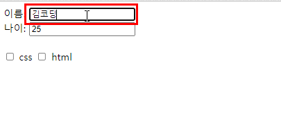
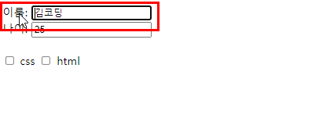

## Input tag
  

  * label + input 함께 사용하지 않았을 때는 input tag를 정확히 클릭해야만 함
  
  
  
  * radio의 `name 값`이 일치해야 선택 그룹으로 묶인다.
    + 문제보기가 4개인 경우에서 1개만 선택할 경우 같은 `name="answer"`로 그룹화해야만 단일 선택이 가능.

  ```javascript
  <li>
    <input type="radio" id="a" name="answer" class="answer" />
    <label id="a_text" for="a">Question</label>
  </li>
  ```
  -------------
### required 속성
  * input 이 비어있으면 자동으로 필수값으로 값을 넣으라고 해주는 유효성 체크 항목.
```javascript
  <input type="text" name="title" id="title" required/>
```

  * required 속성이 제대로 동작하는 input 요소의 type 속성값은 다음과 같다.
    + checkbox, date, email, file, number, password,
      pickers, radio, search, tel, text, url
  * required 속성은 불리언(boolean) 속성.
  * 불리언 속성은 해당 속성을 명시하지 않으면 속성값이 자동으로 false 값을 가지게 되며, 명시하면 자동으로 true 값을 가진다.