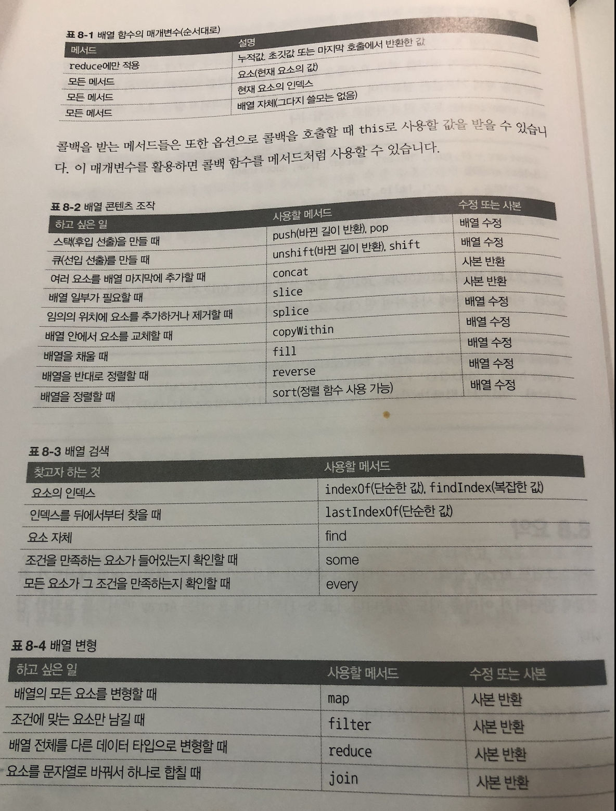
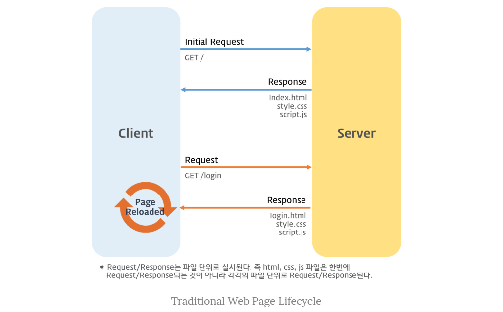
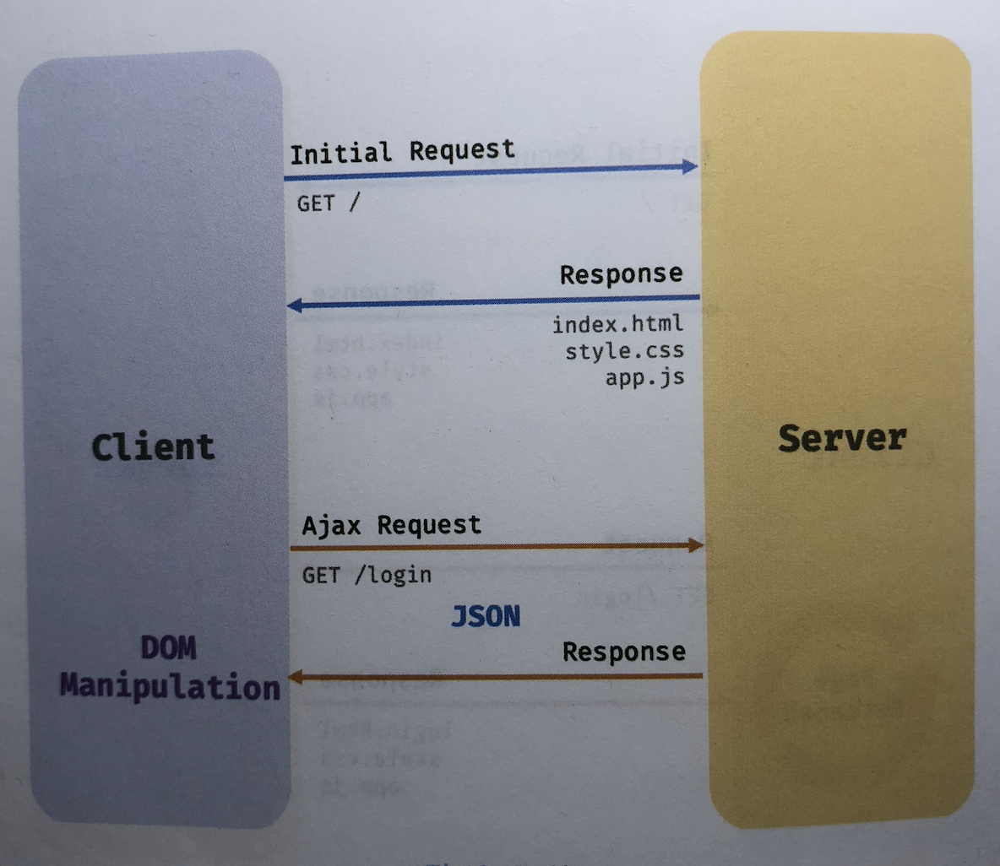

> © 2020 이응모 by WIKIBOOKS
# 목차
# [15장](#15장-:-let,-const-키워드와-블록-레벨-스코프)
  - [var 변수의 문제점](#var-변수의-문제점)
  - [let](#let)
  - [const](#const) 
    + [재할당금지](#재할당금지)
    + [상수](#상수)
    + [const 키워드와 객체](#const-키워드와-객체)
  - [var or let or const](#var-or-let-or-const)

# [27장](#27장-:-배열)
  - [배열요소 조작](#배열요소-조작)
  - [배열의 끝에 여러 요소 추가하기](#배열의-끝에-여러-요소-추가하기)
  - [배열 일부 가져오기](#배열-일부-가져오기)
  - [임의의 위치에 요소 추가하거나 제거하기](#임의의-위치에-요소-추가하거나-제거하기)
  - [얕은 복사(shallow copy)](#얕은-복사(shallow-copy))
  - [깊은 복사(deep copy)](#깊은-복사(deep-copy))
  - [summary](#summary)


# 15장 : let, const 키워드와 블록 레벨 스코프

---------------
### var 변수의 문제점
* var 변수는 오로지 함수의 코드 블록만을 지역 스코프로 인정.
* 따라서 함수 외부에서 var 변수는 코드블록 내에서 선언해도 모두 전역 변수가 된다.

```javascript
var x = 1;
if (true) {
  var x = 10;
}
console.log(x); // 10
```
* for 문에서도 var 선언한 변수도 전역변수가 된다.
* 이는 의도치 않게 전역 변수가 중복 선언되는 경우가 발생한다
---------------
### let
* let 변수는 모든 코드 블록(if, for, while, try/catch..)을 지역 스코프로 인정하는 블록 레벨 스코프를 따른다.

```javascript
let foo = 1; // 전역변수
{
  let foo = 2; // 지역변수
  let bar = 3; //  지역변수
}
console.log(foo);   // 1
console.log(bar);   // ReferenceError: bar is not defined
```
---------------
### const
* const 변수는 선언과 동시에 초기화 해야한다.
* let 과 마찬가지로 Block Level Scope를 가진다.
```javascript
const foo = 1;
const poo; // SyntaxError: Missing initializer in const declaration
```
---------------
#### 재할당 금지
```javascript
const foo = 1;
foo = 2; // TypeError: Assignment to constant variable.
```
---------------
#### 상수
* 일반적으로 상수의 이름은 **대문자로 선언해 상수임을 명확히 나타낸다.**
* 여러 단어로 이루어진 경우 **underscore_로 구분해서 스네이크 케이스로 표현하는 것이 일반적**
```javascript
const TAX_RATE = 0.1;
let preTaxPrice = 100;

let afterTaxPrice = preTaxPrice + ( preTaxPrice + TAX_RATE);
console.log(afterTaxPrice);
```
---------------
#### const 키워드와 객체
* const 재할당을 금지할 뿐 "불변"을 의미하지 않는다. 
* 즉 새로운 값을 재할당 하는 것은 불가능하지만 프로퍼티 동적생성, 삭제, 프로퍼티 값의 변경을 통해 객체를 변경하는 것은 가능하다.
* 이때 객체가 변경되더라도 변수에 할당된 참조 값은 변경되지 않는다.
---------------
## var or let or const
  * var는 사용하지 않는다.
  * 재할당이 필요한 경우 한정해 let를 사용한다. 이때 scope는 최대한 좁게 만든다.
  * 변수 선언시 일단 const로 선언. 반드시 재할딩이 필요하다면 그때 let으로 바꿔도 늦지 않다.

```javascript
let name = 'Irena';
let age = 25;

function greet() { console.log(`Hello, ${name}`);  }
function getBirthYear() { return new Date().getFullYear() - age;}
greet(); // Hello Irena
console.log(getBirthYear()); // 1997
```
* 문제점
  - 함수가 호출하는 컨텍스트(스코프)에 대단히 의존적이라는 것.
  - name value를 (의도 or 실수)바꿀 수 있다.
  - name과 age는 흔한이름므로 다른 곳에서 사용할 가능성이 크다

* 해결방법
  - **사용자 정보를 단일 객체에 보관하는 방법이 낫다**
```javascript
let user = { name = "Irena", age = 25}
function greet(user) { console.log(`Hello, ${user.name}`)}
function getBirthYear(user) { return new Date().getFullYear() - user.age;}
```
* **전역 스코프에 의존하지 않는 것이 정말 중요하다.**
-----------------


# 23장 : 실행 컨텍스트  
  * 개념 : 자바스크립트의 동작 원리의 핵심
  
## 소스코드의 타입
  * 전역 코드 (global) : 전역에 존재하는 소스코드, **전역에 정의된 함수, 클래스 등의 내부 코드는 포함하지 않는다.**
  * 함수 코드 (func) : 함수 내부에 존재하는 소스코드, **함수 내부 중첩된 함수, 클래스는 포함하지 않는다.**
  * eval 코드 (eval) : 빌트인 전역 함수인 eval 함수에 인수로 전달되어 실행되는 소스코드.
  * 모듈 코드 (module) : 모듈 내부에 존재하는 소스코드

> ***소스코드 타입에 따라 실해 컨텍스트 생성 과정과 내용이 다르기 때문***
----------
+ 전역 코드
  1. 최상위 스코프 생성 
  2. var, 전역함수 객체의 property, method 바인딩
  3. 이를 참조하기 위해 전역 객체와 연결 
  4. 전역코드가 평가되면 전역 실행 컨텍스트 생성 

+ 함수 코드
  1. 지역 스코프 생성, 지역변수, 매개변수, argments 객체 관리
  2. 지역 스코프를 전역 스코프의 스코프 체인으로 연결
  3. 함수 코드 평가되면 실해 컨텍스트 생성

+ eval 코드
  1. Strict mode에서 자신만의 독자적인 스코프 생성
  2. eval 코드가 평가되면 eval 실행 컨텍스트 생성

+ module 코드
  1. 모듈별로 독립적인 모듈 스코프 생ㅇ성
  2. 모듈 코드가 평가되면 모듈 실행 컨텍스트 생성
---------

## 소스코드의 평가와 실행
* 모든 소스코드는 실행에 앞서 평가 과정을 거치며 실행하기 위한 준비를 한다.
* 즉 자바스크립트 엔진은 2개의 과정 :***소스코드 평가*** 와 ***소스코드 실행*** 과정으로 나누어 처리
  
  + 평가과정
    1. 실행 컨텍스트를 생성하고 변수 및 함수 등 선언문만 먼저 실행
    2. 생성된 변수나 함수 식별자를 키로 실행 컨텍스트가 관리하는 스코프에 등록(렉시컬 환경)
    3. 평가 과정이 끝나면 선언문을 제외한 소스코드가 순차적 실행(=런타임)
    4. 소스코드에 실행에 필요한 변수, 함수 참조를 실행 컨텍스트가 관리하는 스코프에서 검색해서 취득
   
> [Example]
  ```javascript
  var x;
  x = 1;
  ```
  * 2개 과정으로 처리, 소스코드 평가과정에서 변수 선언문 `var x`;를 먼저 실행, 변수 식별자 `x`는 스코프에 등록되고 `undefined`로 초기화.
  * `x`변수가 선언된 변수인지 확인, 실행 컨텍스트가 관리하는 스코프에 `x` 변수가 등록되어 있다면 값을 할당하고 할당 결과를 실행컨텍스트에 등록 / 관리.
  
  ## 실행 컨텍스트 역할
  > [Example]
  ```javascript
  const x = 1;  // 전역 변수 선언
  const y = 2;  // 전역 변수 선언

  // 함수 정의
  function foo(a) { 
    const x = 10;   // 지역변수 선언
    const y = 20;   // 지역변수 선언

    // 메서드 호출
    console.log(a + x + y); // 130
  }
  foo(100); // 함수 호출
  console.log(x + y);     // 3
  ```

* 전역 코드 평가
  1. `선언문`만 먼저 실행, 즉 전역 코드의 `변수 선언문`과 `함수 선언문`이 먼저 실행.
  2. `전역변수`와 `전역함수` 실행 컨텍스트의 전역 스코프에 등록

* 전역 코드 실행 
  1. `런타임` 시작. 전역 코드가 순차적 실행
  2. 전역 변수에 값이 할당되고 함수 호출
  3. 함수가 호출되면 실행중인 전역 코드의 실행을 일시 중단
  4. 코드 실행순서 변경 -> `함수 내부`로 진입

* 함수 코드 평가
  1. 함수 호출에 의해 함수 내부로 진입
  2. `매개변수`와 `지역 변수 선언문`이 먼저 실행
  3. 생성된 매개변수, 지역변수가 실행 컨텍스트의 `지역 스코프`에 등록
  4. 함수 내부에서 지역 변수처럼 사용할 수 있는 `arguments 객체`가 생성되어 `지역 스코프`에 등록, this 바인딩도 결정

* 함수 코드 실행
  1. 런타임 시작. 함수 코드 순차적 실행
  2. 매개변수, 지역변수 값 할당, console.log 메서드 호출
  3. console 메서드 호출하기 위해 스코프 체인을 통해 console 검색
  4. 이를 위해 함수코드의 지역스코프와 전역스코프와 연결되어야 한다.
  5. .log property를 console 객체의 프로토타입 체인을 통해 검색
  6. 이 후 console.log 메서드에 인수로 전달된 `a + x + y` 평가
  7. `a, x, y` 식별자는 스코프 체인을 통해 검색
  8. console.log 메서드 실행이 종료되면 함수 코드 실행 과정이 종료되고 함수 호출 이전으로 돌아가 전역코드 실행을 계속한다.
  9. 


  


### 25-2 클래스 정의
  ```javascript
  class Person {}
  ```
  ------
  * 일반적이지는 않지만 함수와 마찬가지로 표현식으로도 선언이 가능하다.
  ```javascript
  const Person = class {};
  const Person = class Myclass {};
  ```
  -----
  * 디테일하게 말하자면 **클래스는 함수다** 즉. 일급 객체라는 것을 의미한다.
  ```javascript
    // class declare
    class Person {
      // 생성자
      constructor(name) {
        // 인스턴스 생성 및 초기화
        this.name = name // name property는 public이다.
      }
    // 프로토타입 메서드
    sayHi() { console.log(`Hi! mein Name ist ${this.name}`) }
    // 정적 메서드
    static sayHello() { console.log(`Hello`)} };

    const me = new Person('Lee') //인스턴스 생성
    console.log(me.name) // Lee // 인스턴스의 프로퍼티 참조
    me.sayHi() // Hi! mein Name ist Lee  //프로토타입 메서드 호출
    Person.sayHello(); // Hello
  ```
----
  ### 25-3 Class hositing
  * 클래스는 함수로 평가된다.
  * 변수 선언, 함수 정의와 마찬가지로 호이스팅 발생
  * 단 클래스는 let, const keyword처럼 호이스팅 한다.

  ### 25-4 instance 생성
  * 클래스는 생성자 함수이며 `new` 연산자와 함께 호출되어 인스턴스한다.

  ### 25-5 Method
  * 클래스 몸체에서 선언 가능한 세 가지
    - constructor(생성자)
    - Prototype Method
    - 정적 메서드

  #### 25-5-1 constructor
  * 생성자 (constructor)는 인스턴스를 생성하고 초기하기 위한 특수한 메서드
  * 이름변경 불가
  * constructor 내부에서 this에 추가한 property 는 인스턴스 프로퍼티가 된다.
  * 클래스 내에 최대 `1개`만 존재 가능 (2개시 Error)
  * constructor 생략가능 ( 암묵적 정의되어짐 )
  * 인스턴스 생성시, 클래스 외부에서 인스턴스 Property 초기값을 주려면 `constructor` 선언하고 초기값을 전달한다.
  * constructor 내부에서 `return` 반드시 생략해야 한다. 인스턴스가 반환되지 못하고 return 문에 명시된 객체가 반환된다.
------


# 27장 : 배열

### 배열요소 조작

*** push는 배열 자체를 수정하며 concat은 새 배열을 반환한다.**
```javascript
const arr = ["b", "c", "d"];
arr.push("e");    // ["b", "c", "d", "e"]
arr.pop();        // ["b", "c", "d"]
arr.unshift("a"); // ["a", "b", "c", "d"]
arr.shift();      // ["b", "c", "d"]
```
---------------
### 배열의 끝에 여러 요소 추가하기

* **배열의 끝에 사본을 반환한다. 원본은 미적용**
* concat은 제공받은 배열을 한번만 분해한다. 배열안에 배열을 다시 분해하지 않는다.
```javascript
const arr = [1, 2, 3];
const newArray = arr.concat(4, 5, 6); // [ 1, 2, 3, 4, 5, 6 ]
const newArray1 = arr.concat([4, 5, 6]); // [ 1, 2, 3, 4, 5, 6 ]
const newArray2 = arr.concat([4, 5], 6); // [ 1, 2, 3, 4, 5, 6 ]
const newArray3 = arr.concat([4, [5, 6]]); // [ 1, 2, 3, 4, [ 5, 6 ] ]
console.log(arr); // [ 1, 2, 3 ]
```
----------------

### 배열 일부 가져오기

* 배열의 일부를 가져올 때는 slice 메서드 사용
* 매개변수 2개를 받는다. 첫번째는 어디서부터, 두번째는 어디까지
* 만약 2번째 매개변수를 생략한다면 배열의 마지막까지 반환
* 음수 인덱스를 쓸 수 있고 배열의 끝에서부터 요소를 카운트한다.
* 사본을 반환한다. 원본은 미적용한다.
```javascript
const arr = [1, 2, 3, 4, 5];
//
const arr1 = arr.slice(3); //[ 4, 5 ]
const arr2 = arr.slice(2, 4); // [ 3, 4 ]
const arr3 = arr.slice(-2); // [ 4, 5 ]
const arr4 = arr.slice(1, -2); // [ 2, 3 ]
const arr5 = arr.slice(-2, -1); // [ 4 ]
console.log(arr); // [ 1, 2, 3, 4, 5 ]
```
------------

### 임의의 위치에 요소 추가하거나 제거하기

* splice 배열은 자유롭게 수정할 수 있다.
* **첫 번째 매개변수는 수정을 시작할 인덱스이고 두번째 매개변수는 제거할 요소 숫자**
* **아무 요소도 제거하지 않을 때 0을 넘긴다.**
* 원본에 영향을 미침
```javascript
const arr = [1, 5, 7];
arr.splice(1, 0, 2, 3, 4); // [ 1, 2, 3, 4, 5, 7 ]
arr.splice(5, 0, 6); // [ 1, 2, 3, 4, 5, 6, 7]
arr.splice(1, 2); // [ 1, 4, 5, 6, 7 ]
arr.splice(2, 1, "a", "b"); // [ 1, 4, 'a', 'b', 6, 7 ]
console.log(arr); // [ 1, 4, 'a', 'b', 6, 7 ]
```

### 얕은 복사(shallow copy)

```javascript
const obj1 = { a: 1, b: 2};
const obj2 = obj1;
console.log( obj1 === obj2 ); // true
```
* 위의 예시처럼 객체를 직접 대입하는 경우 참조에 의한 할당이 이루어지므로 둘은 같은 데이터(주소)를 가지고 있다.
  
```javascript
const obj1 = { a:1, b:2 };
const obj2 = obj1;
obj2.a = 100;
console.log( obj1.a ); // 100
```
* 위 두 객체는 같은 데이터(주소)를 가지고 있고, 그래서 같은 주소를 참조하고 있다.
* obj2의 property를 수정하고, obj1를 출력해도 obj2 값과 동일하다.

### 깊은 복사(deep copy)

* 얇은 복사 처럼 주소를 복사해서 공유하는 것이 아니라, 아예 새로운 객체안 속성(property)만 복사 해서 사용할 수 없을까?
  👉 방법 1. …(spread) 연산자를 통한 복사 (과연 깊은 복사가 될까?)

```javascript
const obj1 = { a:1, b:2 };
const obj2 = { ...obj };
obj2.a = 100;
console.log( obj1 === obj2 ) // false
console.log( obj1.a ) // 1
```
* ...(spread) 연산자를 통해 { }안에 obj1의 속성을 복사하여 obj2에 할당하였다.
* 이제 obj1과 obj2는 다른 주소를 갖게되었다. (그러나 딱, 1 depth 까지만)
  👉 방법 2. Object.assign() 메소드를 통한 복사 (과연 깊은 복사가 될까?)

```javascript
const obj1 = { a:1, b:2 };
const obj2 = Object.assign({}, obj1);
obj2.a = 100;
console.log( obj1 === obj2 ) // false
console.log( obj1.a ) // 1
```

* Object.assign() 메소드를 통해 첫 번째 인자로 빈 { } 객체를, 두 번째 인자로 obj1 넣고 obj2 에 할당하였다.
* 이제 obj1과 obj2는 다른 주소를 갖게되었다. (그러나 딱, 1 depth 까지만)

 [Example]

```javascript
const addr = { city: 'seoul', gu: 'seocho'}
const copy = {};
for (let key in addr) {
  copy[key] = addr[key];
}
console.log(addr); // { city: 'Seoul', gu: 'Seocho' } 
console.log(copy); // { city: 'Seoul', gu: 'Seocho' }

addr.gu = 'Gang-nam';

console.log(addr) // { city: 'Seoul', gu: 'Gang-nam' }
console.log(copy) // { city: 'Seoul', gu: 'Seocho' }
```


## summary
* 콜백 함수를 받는 find, findIndex, some, every, map, filter, reduce에서 콜백 함수가 제공 받는 매개변수



### JS 1급객체 예문
----
```javascript
const increase = function (num) {
  return ++num;
};

const predicates = { increase };

function makeCounter(predicates) {
  let num = 0;

  return function () {
    num = predicates(num);
    return num;
  };
}
const increaser = makeCounter(predicates.increase);
console.log(increaser()); // 1

```
> 이해가 안되는 부분은 이 부분이다.
 *parent:predicates, parent:num*    
        


-------------------------

### 이벤트 루프와 태스크 큐  
*  자바스크립트 = 싱글스레드 = 한 번에 하나의 task 처리만 가능
*  하지만, 1개 이상의 데이터 처리를 하는 것은 ***이벤트 루프*** 때문이다.
*  이벤트 루프 = 브라우저 내장 기능

    
> 이벤트 루프와 브라우저 환경

 * task queue : setTImeout, setInterval 과 같이 비동기 함수의 콜백 함수 또는 Event handler 가 일시적으로 보관되는 영역


💡 JS는 싱글 스레드 방식으로 동작, 이때 싱글 스레드 방식으로 동작하는 것은 브라우저가 아니라 브라우저에 내장된 JS 엔진이라는 거!
💡 JS 엔진은 싱글 스레드로 동작하지만 브라우저는 멀티 스레드로 동작한다.


### AJAX
 * 브라우저가 서버에게 비동기 방식으로 데이터를 요청하고, 서버가 응답한 데이터를 수신하여 웹페이지를 동적으로 갱신하는 프로그램 방식          
  ****

> 전통적인 웹 페이지의 생명 주기

   * 단 점
     1. 이전 페이지와 일부 변경되어도 전 부분을 서버로부터 다시 전송받기 때문에 불필요한 데이터 통신 발생
     2. 처음부터 다시 rendering. 순간 깜빡이는 현상 발생
     3. client와 server가 동기식 방식으로 서버로부터 응답이 있을 때까지 다음 처리는 blocking.

------
   

   * 전통적인 방식과 비교했을 때 장 점    
     1. 필요한 부분만 서버로부터 전송받는다.
     2. 변경할 필요가 없는 부분은 렌더링 하지 않는다.
     3. 비동기방식으로 작동하기 때문에 블로킹 발생이 없음

### JSON
* 클라이언트와 서버 간의 HTTP 통신을 위한 텍스트 데이터 포맷
* 반드시 큰 따움표( 작은 따음표 사용 불가)로 묶어야 한다.

    #### JSON.stringify
     + 위 메서드는 객체를 JSON 포맷의 문자열로 변환시켜준다.
        
        ```javascript
            const obj = { name: 'Lee', age: 20, alive: true, hobby: ['traveling','tennis']}

            const json = JSON.stringify(obj)
            // { "name": "Lee", "age": 20, "alive": true, "hobby": ["traveling","tennis"]}
        ```

    #### JSON.parse
     + 위 메서드는 JSON 포맷의 문자열을 객체로 변환한다.
        


-----------------------------

## 오브젝트 복사하기

```javascript
let obj = {
  a: 1,
  b: 2,
};

let copy = obj;

obj.a = 5;
console.log(copy.a); // a = 5;
```

* obj 변수는 새로운 Object Container
* copy 변수는 같은 Object 가르키는 reference
 👀 `{ a: 1, b: 2 }`Object 는 "나에게 접근하는 방법은 2가지가 있지" 라고 말하는 중이다.
 `obj` 변수 또는 `copy` 변수 둘 중 하나를 통해서 object 에 접근할 수 있고 접근 후에는 방법과는 상관없이 value 값 변화가 일어난다.

----

 ### 얕은 오브젝트 복사하기 ( Shallow )

소스 최상위 프로퍼티들이 어떠한 참조없이 복사될 때, Object 는 얕게 복사된다고 한다.
하지만 중첩된 Objects 들은 원본 (original, source) 와 복사본 (copy, target) 사이에서 공유된다.

----
 ### Object.assign() Method
 ----
원본 Object 로부터 복사본 Object로 모든 Enumerable 프로퍼티의 값을 복사하기 위해 사용
물론, 반환 값은 복사본 Object.
```javascript
let obj = { a: 1, b: 2 };
let objCopy = Object.assign({}, obj);
console.log(objCopy)  // { a: 1, b: 2 }
```
---
👀 성공적으로 `obj`의 복사본을 만들었다! 이제 불변성 ( Enumerable ) 존재하는지 확인
```javascript
let obj = { a: 1, b: 2, };
let objCopy = Object.assign({}, obj);

console.log(objCopy); //  { a: 1, b: 2 }
objCopy.b = 89;
console.log(objCopy); //  { a: 1, b: 89 }
console.log(obj);     //  { a: 1, b: 2 }
```

`b`의 값을 `89`로 바꾸고 변경된 `objCopy`에만 적용이 되었다.
이 의미는 원본 Object 에 참조 없이 오브젝트를 복사했다는 것!

--------
### Object.assign() Method 문제점!❓❓

```javascript
let obj = { a: 1, 
            b: { 
                c: 2,
               }, 
          }
let newObj = Object.assign({}, obj);
console.log(newObj); // { a: 1, b: { c: 2} }

obj.a = 10;
console.log(obj); // { a: 10, b: { c: 2} }
console.log(newObj); // { a: 1, b: { c: 2} }

newObj.a = 20;
console.log(obj); // { a: 10, b: { c: 2} }
console.log(newObj); // { a: 20, b: { c: 2} }

newObj.b.c = 30;
console.log(obj); // { a: 10, b: { c: 30} }
console.log(newObj); // { a: 20, b: { c: 30} }

// Note: newObj.b.c = 30; Read why..
```

`Object.assign()` 문제는 바로 얕은 복사만 가능하다는 것.
위 소스에서 `newobj.b` 와 `obj.b`는 둘다 같은 reference 를 공유한다..
왜냐하면 하위 객체는 복사가 이루어지지 않았다.

> 💡 프로토타입 체인과 프로퍼티, non-enumerable 프로퍼티들은 복사될 수 없다.

